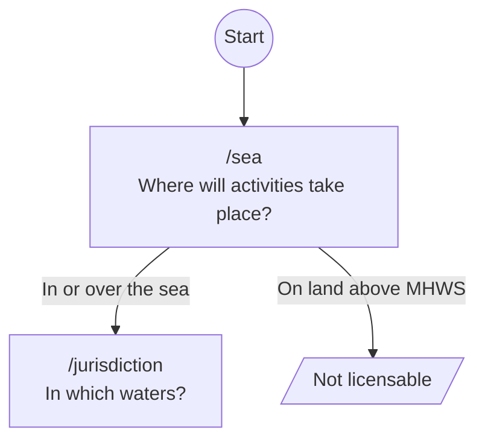
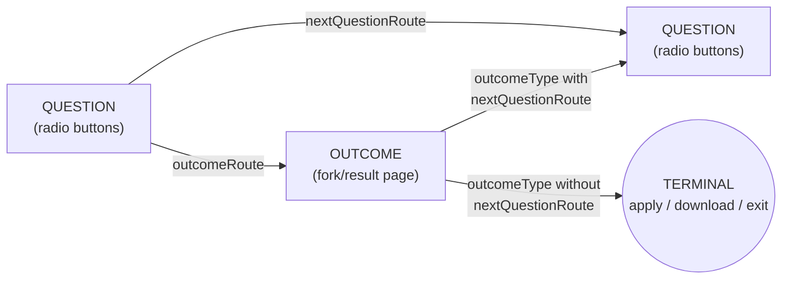
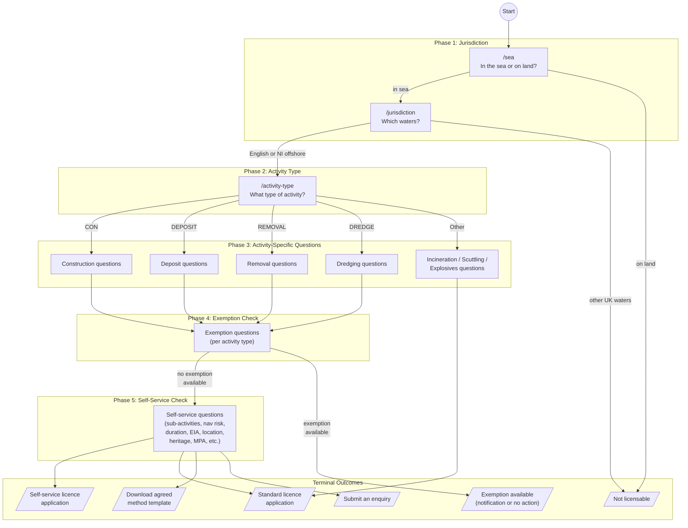
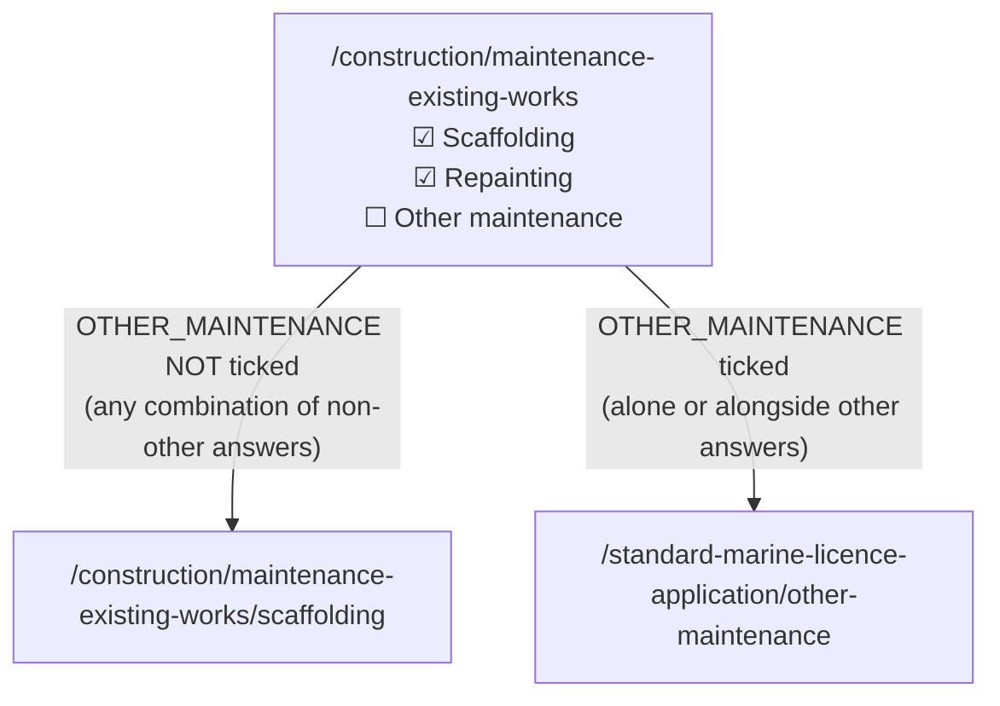
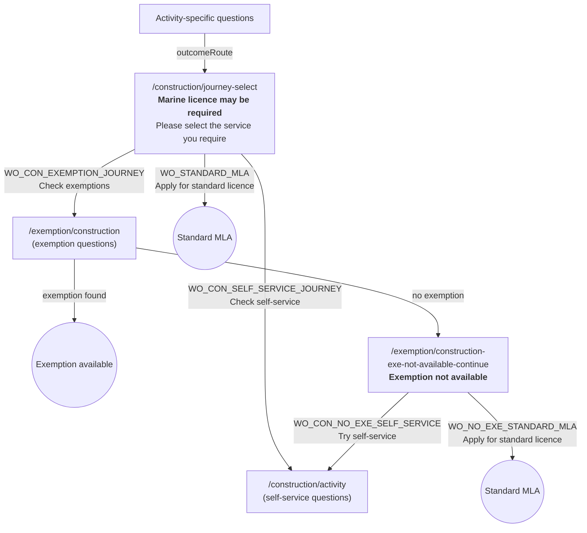
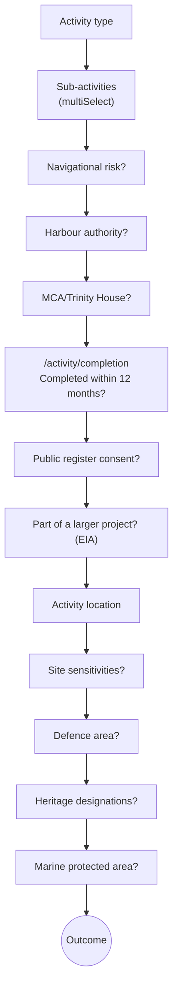

# "Do I Need a Marine Licence?" — JSON Configuration Guide

This document explains the structure and behaviour of the V17 JSON configuration file that drives the MMO's marine licence requirement checker tool.

## What is this?

A decision-tree engine that helps applicants determine whether they need a marine licence. Users answer a series of questions (radio buttons or checkboxes), and the system navigates them to an outcome: an exemption, a licence application, a download, or a "not licensable" result.

**Scale:** 359 question pages, 106 outcome pages, 970 answer options, 48 sections, 99 outcome types.

---

## Top-Level JSON Structure

```
{
  "name":                  "self-service"
  "navBarLinkText":        "Marine licence interactive assistance tool"
  "firstQuestionRoute":    "/sea"               ← entry point
  "documentPreambleText":  "The purpose of..."  ← legal disclaimer
  "sections":              [...]                 ← progress bar groupings
  "outcomeTypes":          [...]                 ← action definitions (apply, download, etc.)
  "outcomes":              [...]                 ← result/fork pages
  "questions":             [...]                 ← the actual question pages
}
```

---

## Where Does It Start?

The entry point is defined by `firstQuestionRoute: "/sea"`.

This first question asks: _"Where will the proposed activities take place?"_ with two answers:

- **"In or over the sea"** → continues to `/jurisdiction`
- **"On land above mean high water springs"** → exits immediately (not licensable)



---

## How Decisions Work

### The Three Node Types

The system has three types of page, connected by three routing mechanisms:



### 1. Questions (359 pages)

A question page presents radio buttons (or occasionally checkboxes). Each answer either leads to another question or to an outcome.

```json
{
  "route": "/jurisdiction",
  "text": "In which waters will the activity take place?",
  "hint": "See an illustration of these 'waters'...",
  "section": "doINeedAMarineLicence",
  "answers": [
    {
      "id": "englishWaters",
      "text": "In English waters",
      "nextQuestionRoute": "/activity-type"
    },
    {
      "id": "otherUkWaters",
      "text": "In other UK waters",
      "outcomeRoute": "/licence-not-required-devolved"
    }
  ]
}
```

**Fields:**

| Field                | Required | Purpose                                                                      |
| -------------------- | -------- | ---------------------------------------------------------------------------- |
| `route`              | Yes      | URL path for this page                                                       |
| `text`               | Yes      | The question shown to the user                                               |
| `hint`               | No       | Help text (may contain HTML)                                                 |
| `section`            | No       | Which progress bar section this belongs to (absent on 4 burial-at-sea pages) |
| `answers`            | Yes      | Array of radio button options                                                |
| `multiSelect`        | No       | If present, page uses checkboxes instead (see below)                         |
| `mcmsAppFormMapping` | No       | Maps this question to a field in the MCMS application form                   |

**Answer fields:**

| Field               | Required | Purpose                              |
| ------------------- | -------- | ------------------------------------ |
| `id`                | Yes      | Machine identifier for this answer   |
| `text`              | Yes      | Label shown to the user              |
| `hint`              | No       | Expandable help text for this option |
| `nextQuestionRoute` | No\*     | Go to another question               |
| `outcomeRoute`      | No\*     | Go to an outcome page                |

\* Every answer on a radio-button page must have exactly one of `nextQuestionRoute` or `outcomeRoute`.

### 2. Outcomes (106 pages)

An outcome page displays a result and presents one or more actions (defined by `outcomeTypes`).

```json
{
  "route": "/exemption/construction-exe-not-available-continue",
  "heading": "Exemption not available",
  "section": "doINeedAMarineLicenceConstruction",
  "text": "<b>Please select the service you require.</b>...",
  "outcomeTypes": ["WO_CON_NO_EXE_SELF_SERVICE", "WO_NO_EXE_STANDARD_MLA"]
}
```

- When an outcome has **one** outcomeType → it's a terminal result page
- When an outcome has **multiple** outcomeTypes → it's a fork (user chooses next step)

### 3. OutcomeTypes (99 definitions)

These define what the user can _do_ at an outcome page. They are the leaf actions of the system.

```json
{
  "id": "WO_FAST_TRACK_MLA",
  "heading": "Apply for a self-service marine licence",
  "text": "Based on the information provided...",
  "module": "MMO_APP2_CONTROL",
  "entryTheme": "new",
  "params": [{ "name": "FAST_TRACK", "value": "true" }]
}
```

**Types of outcomeType:**

| Category                | What it does                                 | Key fields                                       | Count |
| ----------------------- | -------------------------------------------- | ------------------------------------------------ | ----- |
| **Application launch**  | Opens the licence application                | `module: "MMO_APP2_CONTROL"`                     | ~10   |
| **Advice/notification** | Opens an enquiry or exemption form           | `module: "MMO_ADVICE_CONTROL"` + `params`        | ~33   |
| **External redirect**   | Redirects to Defra marine licensing frontend | `overrideCtaButtonUrl` + `overrideCtaButtonText` | 12    |
| **Download**            | Provides a .docx template                    | `link: "https://...docx"`                        | ~8    |
| **External link**       | Opens an external tool (e.g. ArcGIS map)     | `link: "https://..."`                            | ~2    |
| **Info only**           | Displays text, no action                     | (no module/link)                                 | ~22   |
| **Routing**             | Sends user back into the question tree       | `nextQuestionRoute`                              | 12    |

---

## The Full Flow — Start to Finish



### The Five Phases

| Phase                     | What happens                                        | Section IDs                                                                                                                                                                          |
| ------------------------- | --------------------------------------------------- | ------------------------------------------------------------------------------------------------------------------------------------------------------------------------------------ |
| **1. Jurisdiction**       | Is it in the sea? Which waters?                     | `doINeedAMarineLicence`                                                                                                                                                              |
| **2. Activity type**      | Construction, deposit, removal, dredging, or other? | `doINeedAMarineLicence{Type}`                                                                                                                                                        |
| **3. Activity details**   | Specific questions about the proposed activity      | `doINeedAMarineLicence{Type}`                                                                                                                                                        |
| **4. Exemption check**    | Does an exemption article apply?                    | `construction`, `deposit`, `removal`, `dredging`                                                                                                                                     |
| **5. Self-service check** | Is the activity suitable for fast-track licensing?  | `activityType`, `subactivityType`, `navigationalRisk`, `durationOfWorks`, `activityLocation`, `siteSensitivities`, `defence`, `protectionOfHeritage`, `marineProtectedArea200`, etc. |

---

## Complex Parts

### 1. MultiSelect Pages (Checkbox Questions)

Five pages use checkboxes instead of radio buttons. These are the sub-activity selection pages in the self-service check.

```json
{
  "route": "/construction/maintenance-existing-works",
  "text": "Please select sub-activities...",
  "multiSelect": {
    "questionRoute": "/construction/maintenance-existing-works/scaffolding",
    "outcomeRoute": "/standard-marine-licence-application/other-maintenance",
    "outcomeAnswerId": "OTHER_MAINTENANCE"
  },
  "answers": [
    { "id": "SCAFFOLDING_ACCESS_TOWERS", "text": "Scaffolding or access towers" },
    { "id": "REPAINTING_STRUCTURES", "text": "Re-painting..." },
    ...
    { "id": "OTHER_MAINTENANCE", "text": "Other maintenance" }
  ]
}
```

**How multiSelect routing works:**



- Individual answers on multiSelect pages have **no routes** — routing is on the `multiSelect` object.
- The rule (matches the legacy Fivium behaviour, `JourneyService.getMultiSelectNextRoute`): if the `outcomeAnswerId` answer is ticked **at all** (alone or alongside non-other answers), the user goes to `outcomeRoute` (their activity doesn't fit any of the self-service sub-activity categories). Only when `outcomeAnswerId` is unticked do they continue via `questionRoute`.
- The runtime implementation lives in `services/journey-router.js` (`calculateNextRoute` → `calculateMultiSelectRoute`).

**The five multiSelect pages:**

| Page                                       | Continues to                    | "Other" goes to            |
| ------------------------------------------ | ------------------------------- | -------------------------- |
| `/construction/maintenance-existing-works` | `/construction/.../scaffolding` | Standard MLA (maintenance) |
| `/removal/activities`                      | `/activity/completion`          | Standard MLA (removals)    |
| `/dredging/activities`                     | `/activity/completion`          | Standard MLA (dredging)    |
| `/dredging/beach-maintenance/activities`   | `/activity/completion`          | Standard MLA (beach)       |
| `/deposit/markers/activities`              | `/activity/completion`          | Standard MLA (deposits)    |

### 2. Outcome Fork Pages (Re-entry into the Question Tree)

Eight outcome pages act as decision forks — they present the user with choices that route **back into** the question tree. This is the most architecturally complex part of the system.



**The 12 routing outcomeTypes:**

| OutcomeType ID                     | Routes to                          |
| ---------------------------------- | ---------------------------------- |
| `WO_CON_EXEMPTION_JOURNEY`         | `/exemption/construction`          |
| `WO_CON_SELF_SERVICE_JOURNEY`      | `/construction/activity`           |
| `WO_CON_NO_EXE_SELF_SERVICE`       | `/construction/activity`           |
| `WO_DEPOSIT_EXEMPTION_JOURNEY`     | `/exemption/deposit/activity-type` |
| `WO_DEPOSIT_SELF_SERVICE_JOURNEY`  | `/deposit/activity`                |
| `WO_DEPOSIT_NO_EXE_SELF_SERVICE`   | `/deposit/activity`                |
| `WO_REMOVAL_EXEMPTION_JOURNEY`     | `/exemption/removal/activity-type` |
| `WO_REMOVAL_SELF_SERVICE_JOURNEY`  | `/removal/activity`                |
| `WO_REMOVAL_NO_EXE_SELF_SERVICE`   | `/removal/activity`                |
| `WO_DREDGING_EXEMPTION_JOURNEY`    | `/exemption/dredging`              |
| `WO_DREDGING_SELF_SERVICE_JOURNEY` | `/dredging/activity`               |
| `WO_DREDGING_NO_EXE_SELF_SERVICE`  | `/dredging/activity`               |

### 3. The Self-Service Gauntlet

The self-service check is the longest and most complex path. After selecting sub-activities, users must pass through up to ~15 additional questions:



Any "No" at the wrong point typically diverts to a standard licence application (the activity doesn't qualify for self-service).

---

## Where Does It End?

Every journey ends at a **terminal outcomeType**. There are 87 terminal outcomeTypes, falling into these categories:

### Exemption Available (~40 outcomes)

Named `WO_EXE_AVAILABLE_ARTICLE_{N}` — the activity is exempt under a specific article of the Marine and Coastal Access Act 2009. Some require notification to the MMO, some don't.

### Not Licensable (~10 outcomes)

Named `WO_EXE_NOT_LICENSABLE_*` — the activity doesn't require a marine licence at all (e.g. it's on land, in devolved waters, or involves cables outside 12NM).

### Licence Required (~10 outcomes)

Named `WO_STANDARD_TRACK_MLA*` or `WO_FAST_TRACK_MLA*` — launches the licence application module (`MMO_APP2_CONTROL`).

### Download Template (~8 outcomes)

Named `WO_DOWNLOAD_*_AGREED_METHOD_TEMPLATE` — provides a .docx template that must be agreed with a harbour authority, Trinity House, Natural England, or Historic England.

### Enquiry / EIA (~4 outcomes)

Named `WO_ENQUIRY` or `WO_EIA` — launches the advice module (`MMO_ADVICE_CONTROL`) for complex cases.

---

## Edge Cases

### 1. The "Elsewhere in the World" Branch

Selecting "Somewhere else in the world" at `/jurisdiction` enters a completely separate question tree under `/elsewhere-in-the-world/...` with its own activity types (deposit, scuttling, incineration). The key constraint: the activity must involve a British vessel/aircraft/marine structure, or it's outside MMO jurisdiction entirely.

### 2. Northern Ireland Offshore Waters

Selecting "Northern Ireland offshore waters" at `/jurisdiction` enters the same activity-type flow as English waters — but with potentially different exemption outcomes.

### 3. `/activity/completion` — The Convergence Point

Four of the five multiSelect pages route to `/activity/completion` ("Will activities be completed within 12 months?"). This is a critical gate: answering "No" immediately diverts to a standard licence. This single page sits at the junction of four activity-type branches.

### 4. Orphaned Pages

**4 unreachable questions** — defined in the JSON but no route points to them:

- `/exemption/construction/maintenance/pontoons`
- `/exemption/deposit/pollution/pollution-prevention`
- `/exemption/removal/waste/litter-seaweed/lse`
- `/exemption/dredging/coastal-drainage-flood/maintenance/CPA/beach-replenishment`

These may be legacy pages from earlier versions, or they may be reached by application logic outside this JSON.

**13 unreachable outcomes** — defined but never referenced by any `outcomeRoute`:

- The 4 `/journey-select` pages (construction, deposit, removal, dredging)
- The 8 `/standard-marine-licence-application/*` pages
- `/not-licensable`
- `/exemption/licence-not-required`

These are likely reached by hardcoded routes in the application rather than through the JSON decision tree.

**3 unreferenced outcomeTypes** — defined but not used by any outcome page:

- `WO_INTERACTIVE_MAP_STAGE1`
- `WO_INTERACTIVE_MAP`
- `WO_EXE_AVAILABLE_SECTION_81`

### 5. HTML in Content Fields

Some `text` and `hint` fields contain raw HTML. The presence of HTML varies
significantly by field type — it is concentrated in outcome/guidance content
and largely absent from form labels.

**Where HTML occurs:**

| Field              | With HTML | Total | Prevalence |
| ------------------ | --------- | ----- | ---------- |
| `outcomeType.text` | 90        | 99    | 91%        |
| `question.hint`    | 63        | 359   | 18%        |
| `outcome.text`     | 8         | 106   | 8%         |
| `answer.hint`      | 4         | 970   | < 1%       |
| `question.text`    | 1         | 359   | < 1%       |

**Where HTML does NOT occur:**

| Field          | Total | HTML |
| -------------- | ----- | ---- |
| `answer.text`  | 970   | None |
| `section.text` | 48    | None |

**Tags used (across all fields):**

| Tag               | Purpose                          |
| ----------------- | -------------------------------- |
| `<p>`             | Paragraph breaks (most common)   |
| `<a>`             | External links (always gov.uk)   |
| `<b>`, `<strong>` | Bold emphasis                    |
| `<ul>`, `<li>`    | Unordered lists                  |
| `<ol type="i">`   | Ordered list (roman numerals, 1) |
| `<br/>`           | Line breaks                      |
| `<u>`             | Underline (rare, 2 instances)    |

**HTML quality issues in the source data:**

- Doubled tags: `<p><p>` and `<b><b>` appear in several outcomeType texts
- One `question.text` has malformed list markup (`</li><li>` without a
  wrapping `<ul>`)

**Verification with jq:**

All filters below run against `self-service.json`. The `test("<")` check
matches any field containing an HTML tag.

```bash
# Count totals per field type
jq '.outcomeTypes | length' self-service.json                        # 99
jq '.questions | length' self-service.json                           # 359
jq '.outcomes | length' self-service.json                            # 106
jq '[.questions[].answers[]] | length' self-service.json             # 970
jq '.sections | length' self-service.json                            # 48

# outcomeType.text — 90/99 contain HTML
jq '[.outcomeTypes[] | select(.text | test("<"))] | length' self-service.json
jq '.outcomeTypes[] | select(.text | test("<")) | {id, text}' self-service.json

# question.hint — 63/359 contain HTML
jq '[.questions[] | select(.hint? // "" | test("<"))] | length' self-service.json
jq '.questions[] | select(.hint? // "" | test("<")) | {route, hint}' self-service.json

# outcome.text — 8/106 contain HTML
jq '[.outcomes[] | select(.text? // "" | test("<"))] | length' self-service.json
jq '.outcomes[] | select(.text? // "" | test("<")) | {route, text}' self-service.json

# answer.hint — 4/970 contain HTML
jq '[.questions[].answers[] | select(.hint? // "" | test("<"))] | length' self-service.json
jq '.questions[].answers[] | select(.hint? // "" | test("<")) | {id, hint}' self-service.json

# question.text — 1/359 contains HTML (malformed list markup)
jq '[.questions[] | select(.text | test("<"))] | length' self-service.json
jq '.questions[] | select(.text | test("<")) | {route, text}' self-service.json

# answer.text — confirm zero HTML
jq '[.questions[].answers[] | select(.text | test("<"))] | length' self-service.json

# section.text — confirm zero HTML
jq '[.sections[] | select(.text | test("<"))] | length' self-service.json

# List distinct HTML tags across all fields
jq '[
  .outcomeTypes[].text,
  (.questions[] | .text, (.hint // ""), (.answers[] | .text, (.hint // ""))),
  (.outcomes[] | (.text // ""))
] | map(scan("</?[a-zA-Z][a-zA-Z0-9]*")) | flatten | unique | .[]' self-service.json
```

**Sanitisation:**

`question.hint` and `answer.hint` fields are sanitised at load time by
`journey-data.js` (via `sanitise.js`) using an allowlist of safe tags and
attributes. `question.text` and `section.text` are stripped of all HTML at
load time. The `text` fields on outcomes and outcomeTypes are also sanitised
at load time via `sanitiseRichText` (same allowlist as `sanitise`, minus the
`govuk-hint` class transform).

---

## Deep Links and External Entry Points

### Pages Reached Only via OutcomeType Routing

These question pages are **not reachable** by following `nextQuestionRoute` from other questions. They can only be entered when a user selects an outcomeType on a fork page:

| Page                               | Reached via                                                             |
| ---------------------------------- | ----------------------------------------------------------------------- |
| `/construction/activity`           | `WO_CON_SELF_SERVICE_JOURNEY` or `WO_CON_NO_EXE_SELF_SERVICE`           |
| `/deposit/activity`                | `WO_DEPOSIT_SELF_SERVICE_JOURNEY` or `WO_DEPOSIT_NO_EXE_SELF_SERVICE`   |
| `/removal/activity`                | `WO_REMOVAL_SELF_SERVICE_JOURNEY` or `WO_REMOVAL_NO_EXE_SELF_SERVICE`   |
| `/dredging/activity`               | `WO_DREDGING_SELF_SERVICE_JOURNEY` or `WO_DREDGING_NO_EXE_SELF_SERVICE` |
| `/exemption/construction`          | `WO_CON_EXEMPTION_JOURNEY`                                              |
| `/exemption/deposit/activity-type` | `WO_DEPOSIT_EXEMPTION_JOURNEY`                                          |
| `/exemption/removal/activity-type` | `WO_REMOVAL_EXEMPTION_JOURNEY`                                          |
| `/exemption/dredging`              | `WO_DREDGING_EXEMPTION_JOURNEY`                                         |

In the generated site, these pages must be valid entry points even though no question's answer directly links to them.

---

## The `mcmsAppFormMapping` Field

22 questions carry a `mcmsAppFormMapping` field. This maps the user's answer to a named field in the MCMS (Marine Case Management System) application form. When the user eventually submits a licence application, the answers to these specific questions pre-populate the form.

Key mappings:

| Mapping                                 | Question                                 |
| --------------------------------------- | ---------------------------------------- |
| `ACTIVITY_TYPE`                         | `/activity-type`                         |
| `ACTIVITY_SUBTYPE_CONSTRUCTION`         | Construction sub-type                    |
| `MAINTENANCE_EXISTING_WORKS_ACTIVITIES` | Maintenance sub-activities (multiSelect) |
| `SINGLE_LOCATION`                       | Single or multiple locations             |
| `HISTORIC_ENGLAND`                      | Historic England method agreed           |
| `NATURAL_ENGLAND`                       | Natural England method agreed            |
| `SCAFFOLDING_HA_METHOD`                 | Harbour authority method agreed          |

This data must be preserved through the journey and passed to the application module at the end.

---

## The `params` Field on OutcomeTypes

Some outcomeTypes carry `params` — key-value pairs passed to the destination module when launching it:

```json
{
  "id": "WO_FAST_TRACK_MLA",
  "module": "MMO_APP2_CONTROL",
  "params": [{ "name": "FAST_TRACK", "value": "true" }]
}
```

```json
{
  "id": "WO_EXE_AVAILABLE_ARTICLE_25",
  "module": "MMO_ADVICE_CONTROL",
  "params": [
    { "name": "ADV_TYPE", "value": "EXE" },
    { "name": "ARTICLE", "value": "25" }
  ]
}
```

These parameters configure what the destination module does — which form to show, which article to reference, whether it's a fast-track application, etc.

---

## Summary: What the Generated Site Must Handle

| Concern                     | Count | Notes                                                          |
| --------------------------- | ----- | -------------------------------------------------------------- |
| Radio button question pages | 354   | Standard GOV.UK radios                                         |
| Checkbox question pages     | 5     | MultiSelect with special routing                               |
| Outcome pages (terminal)    | 98    | Display result + action buttons                                |
| Outcome pages (fork)        | 8     | Display choices that re-enter question tree                    |
| Transitions to test         | 1,078 | Each is a single verifiable assertion                          |
| Terminal outcomes           | 87    | Distinct end-states                                            |
| Sections (progress bar)     | 48    | Grouped into 5 phases                                          |
| MCMS form mappings          | 22    | Answers to carry forward                                       |
| HTML content fields         | ~166  | Concentrated in outcomeType.text (91%) and question.hint (18%) |
| External links in content   | ~50+  | GOV.UK guidance, ArcGIS maps, .docx downloads                  |
