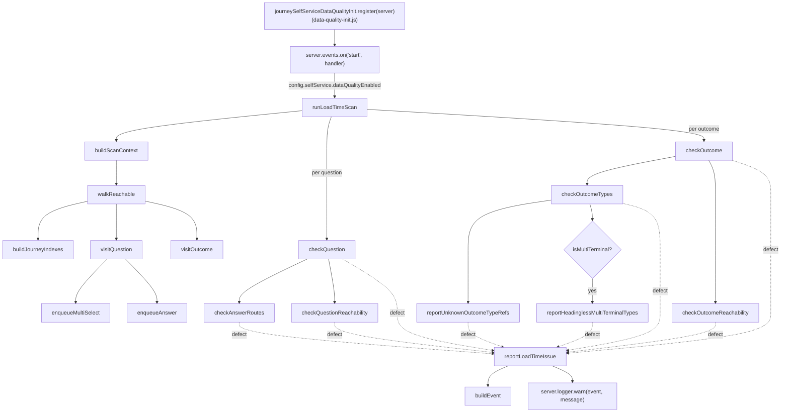
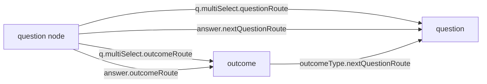
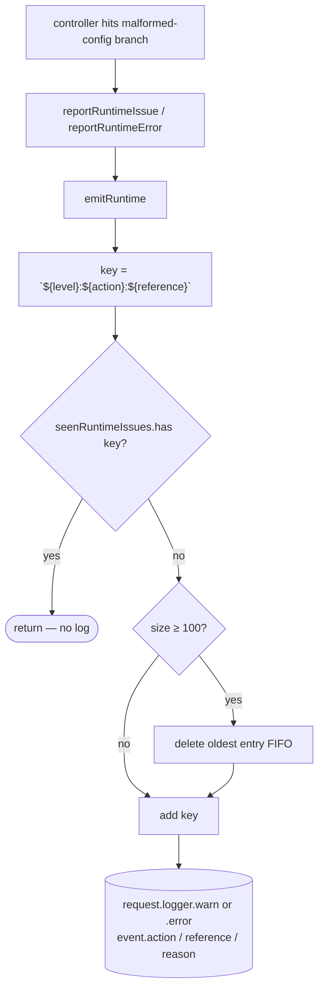

# `data-quality.js` — data flow

This module reports problems with the self-service journey configuration
(`self-service.json`) as **structured ECS log events**. It does not throw, does
not mutate the journey, and does not affect request handling — it only tells an
engineer (via OpenSearch) that the config is wrong.

There are two independent flows:

1. **Load-time scan** — runs once when the Hapi server emits `start`. Walks the
   entire journey graph and emits one log line per defect found.
2. **Runtime reporting** — called from request handlers when a controller hits
   a malformed-config branch (e.g. an answer with no route, an outcome that
   references an unknown outcomeType). Deduped per process.

Both flows share the same log shape (`reportLoadTimeIssue` / `emitRuntime` →
`buildEvent`) so a defect surfaces under the same `event.action` whether it was
caught at boot or in production traffic.

## Module surface

| Export                | Caller                                       | Logger             |
| --------------------- | -------------------------------------------- | ------------------ |
| `runLoadTimeScan`     | `data-quality-init.js` (Hapi `start` event)  | `server.logger`    |
| `reportLoadTimeIssue` | Internal to `runLoadTimeScan`'s checks       | passed-in `logger` |
| `reportRuntimeIssue`  | `outcome/controller.js`, `question/utils.js` | `request.logger`   |
| `reportRuntimeError`  | `question/controller.js`                     | `request.logger`   |

The runtime callers are reached on routes registered with `auth: false`, so the
`seenRuntimeIssues` Set is bounded (`MAX_SEEN_RUNTIME_ISSUES = 100`, FIFO
eviction) to prevent an unauthenticated client from growing it without limit.

## Flow 1 — load-time scan

The scan is wired up by the `journeySelfServiceDataQualityInit` Hapi plugin
(registered in `src/server/router.js`). On the server's `start` event it gates
on `config.get('selfService.dataQualityEnabled')` and, if enabled, calls
`runLoadTimeScan(server.logger, getJourneyData())`.

From there, every function in `data-quality.js` is reachable through this call
tree. Every leaf `check*` / `report*` function ultimately calls
`reportLoadTimeIssue` when it finds a defect:



Solid arrows are unconditional calls; dotted arrows are the `reportLoadTimeIssue`
calls that fire only when a check actually finds a problem.

### Reachability walk

`walkReachable` is a BFS over the journey graph. The two `Set`s are passed in
empty and **mutated in place**; nothing is returned.



`visitQuestion` adds `node.route` to `reachableQuestions` and enqueues
successors via `enqueueMultiSelect` / `enqueueAnswer`. `visitOutcome` adds to
`reachableOutcomes` and enqueues any `nextQuestionRoute` exposed by the
outcome's referenced outcomeTypes — which is how a terminal-typed outcome can
loop back into another question.

The two filled sets are then consumed by `checkQuestionReachability` and
`checkOutcomeReachability` to flag orphans (`question-orphan`, `outcome-orphan`).

### Defects emitted by the load-time scan

| `event.action`                     | Trigger                                                                         |
| ---------------------------------- | ------------------------------------------------------------------------------- |
| `question-no-answers`              | Question with empty/missing `answers`                                           |
| `answer-no-route`                  | Single-select answer with neither `nextQuestionRoute` nor `outcomeRoute`        |
| `question-orphan`                  | Question unreachable from `firstQuestionRoute`                                  |
| `outcome-missing-heading`          | Outcome with no `heading`                                                       |
| `outcome-empty-outcome-types`      | Outcome with empty/missing `outcomeTypes`                                       |
| `outcome-unknown-outcome-type-ref` | Outcome references an undefined outcomeType id                                  |
| `outcometype-missing-heading`      | OutcomeType rendered as a card on a multi-terminal outcome but has no `heading` |
| `outcome-orphan`                   | Outcome unreachable from any answer or outcomeType                              |

## Flow 2 — runtime reporting



`level` is `'warn'` for `reportRuntimeIssue` and `'error'` for
`reportRuntimeError`, so a warn and an error for the same `(action, reference)`
pair are tracked as **separate** dedup keys and will both fire once.

## Log shape

Every line produced by this module goes through `buildEvent`, which yields:

```js
{
  event: {
    action: '<see tables above>',
    reference: '<route or id the defect is anchored on>',
    reason: '<remediation prose — what an engineer should change in self-service.json>',
    outcome: 'failure'
  }
}
```

…with a free-form `message` of `iat-data-quality: <summary>`. This matches the
CDP streamlined ECS schema (`event/action`, `event/reference`, `event/reason`,
`event/outcome`) so the lines are queryable in OpenSearch rather than dropped
into `broken_logs`.
